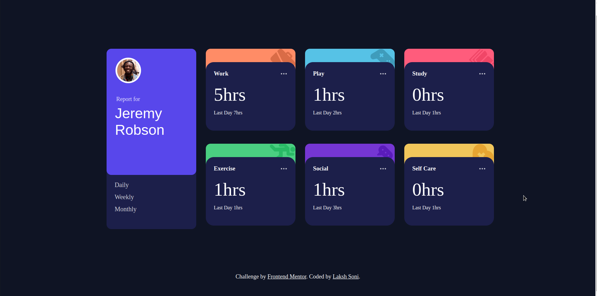

# Frontend Mentor - Time tracking dashboard solution

This is a solution to the [Time tracking dashboard challenge on Frontend Mentor](https://www.frontendmentor.io/challenges/time-tracking-dashboard-UIQ7167Jw). Frontend Mentor challenges help you improve your coding skills by building realistic projects. 

## Table of contents

- [Overview](#overview)
- [The challenge](#the-challenge)
- [Screenshot](#screenshot)
- [Links](#links)
- [Built with](#built-with)
- [What I learned](#what-i-learned)
- [Author](#author)

**Note: Delete this note and update the table of contents based on what sections you keep.**

## Overview

Time Tracking Dashboard is a Single Page Website which helps us to manage review our time based on Daily,Weekly and Monthly Stats 

### The challenge

Users should be able to:

- View the optimal layout for the site depending on their device's screen size
- See hover states for all interactive elements on the page
- Switch between viewing Daily, Weekly, and Monthly stats

### Screenshot

### Links

- Solution URL: https://github.com/lakshsoni21/Time-Tracking-Dashboard/tree/master
- Live Site URL: https://time-tracking-dashboard-l.netlify.app

### Built with

- Semantic HTML5 markup
- CSS custom properties
- Flexbox
- CSS Grid

### What I learned
- I Learned more about grid properly to create a respnsive website
- I learned, how to fetch the data from the json file and put out the dynamic content on the HTML
  and this project also helped me to brush up my JS Concpets like Promise and fetch api.

## Author

- Frontend Mentor - [@lakshsoni21](https://www.frontendmentor.io/profile/lakshsoni21)
- Twitter - [@LakshSoni18](https://twitter.com/LakshSoni18)

